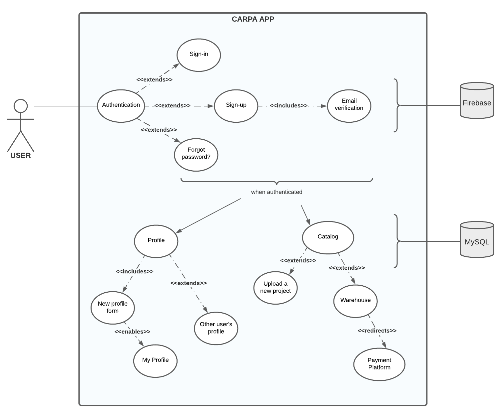

# Carpa

_Angular and Spring Boot App / Ironhack 2021_

  

 

Welcome! This is <b>Carpa</b>, the new platform to upload your 3D designs. Be part of our <b>growing community</b> and <b>share your favourite projects</b> with us, it's easy and you can earn income for it.

Not feeling inspired lately? If you prefer, you can dive into our warehouse among the designs of other members and <b>download</b> them if you find something inspiring or that you simply love.

If you are wondering if the designs are suitable for your <b>3D printer</b>, don't worry at all. All projects are in <b>.stl</b> format, which facilitates a direct flow from Carpa to your printer.

Do not miss out and join us today!

## Instalation

1. Download this project from the repository.

2. Go to the back-end directory.

3. Run the back-end : `./mvnw spring-boot:run.`

4. Go to the front-end directory.

5. Run the front-end : `ng serve -o`

6. And the most important part... enjoy!

## Use Case Diagram

  

